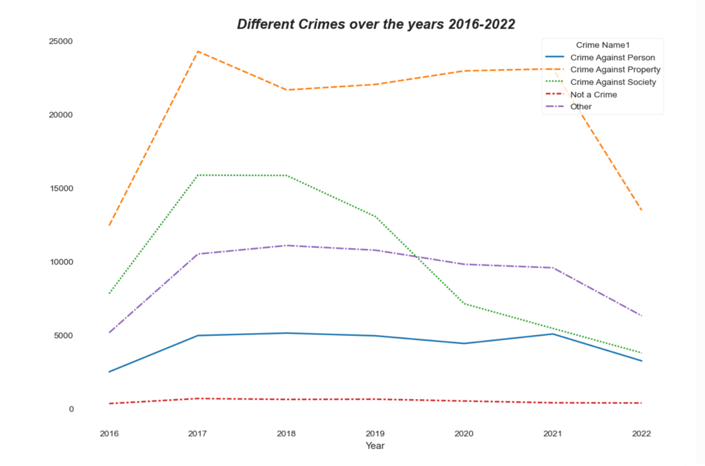
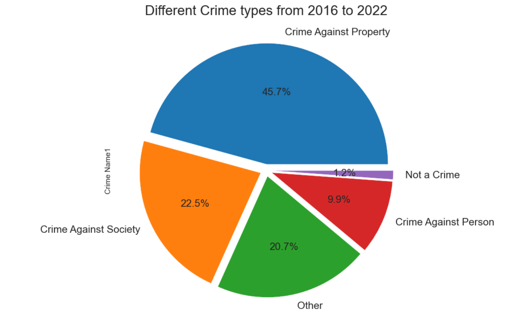
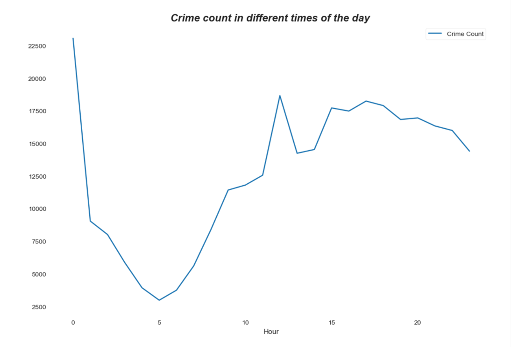

# EDA-Python
# Exploratory Data Analysis of Montgomery County Crime Data Using Python. 📊🔍

An end-to-end exploratory data analysis (EDA) framework tracking criminal incident updates across Montgomery County, Maryland. This project leverages historical law enforcement dispatch logs reported under the **National Incident-Based Reporting System (NIBRS)** to construct granular geo-spatial, structural, and temporal maps highlighting safety trends, regional hot-zones, and crime volume categories.

---

## 🛠️ Tech Stack & Core Libraries
- **Data Engineering:** `Pandas`, `NumPy`
- **Statistical Visualization:** `Matplotlib`, `Seaborn`
- **Text & Keyword Mining:** `WordCloud`

---

## 📂 Dataset Overview
The dataset profiles comprehensive criminal statistics compiled through records management systems utilized by the Montgomery County Police Department. It covers over **306,000 individual incident entries** across **30 key attribute headers**:
- **Spatial Triggers:** Police District Name, City, Block Address, Zip Code, Latitude, Longitude.
- **Classification Classifiers:** NIBRS Code, Crime Name 1 (Society/Property/Person), Crime Name 2, Crime Name 3.
- **Temporal Vectors:** Dispatch Date/Time, Start Date/Time, End Date/Time.

> ⚠️ **Note on Data Source:** Because the raw dataset file (`Crime.csv`) is hosted externally. You must download the dataset from Kaggle before running the notebook. Data can be downloaded from https://www.kaggle.com/datasets/ameeraabdi/montgomery-crime-dataset?select=Crime.csv

---
## Dashboard Preview

---

## 🚀 Key Insights & Analytics Derived
- **Temporal Trends:** Crime occurrences inside Montgomery County reflect a steady visual decrease since their baseline peaks highlighted in the year **2017**.
- **Prevalent Categories:** **Crimes Against Property** rank as the single most frequent classification type across almost all analyzed districts, driven significantly by high baseline volumes of *Theft from Motor Vehicles*.
- **Temporal Hotspots:** A significant density of criminal infractions and dispatches occur around the **midnight hours** rather than daytime blocks.
- **Regional Disparity:** Geographically, **Silver Spring** displays a statistically higher volume and risk metrics baseline compared to peer county processing districts.

---

