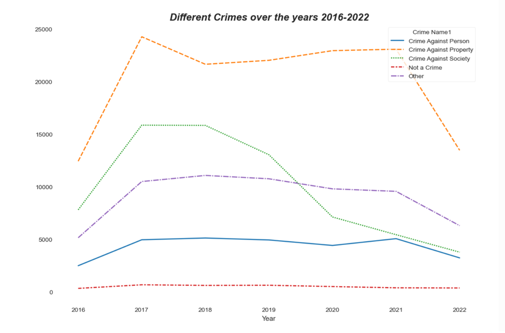
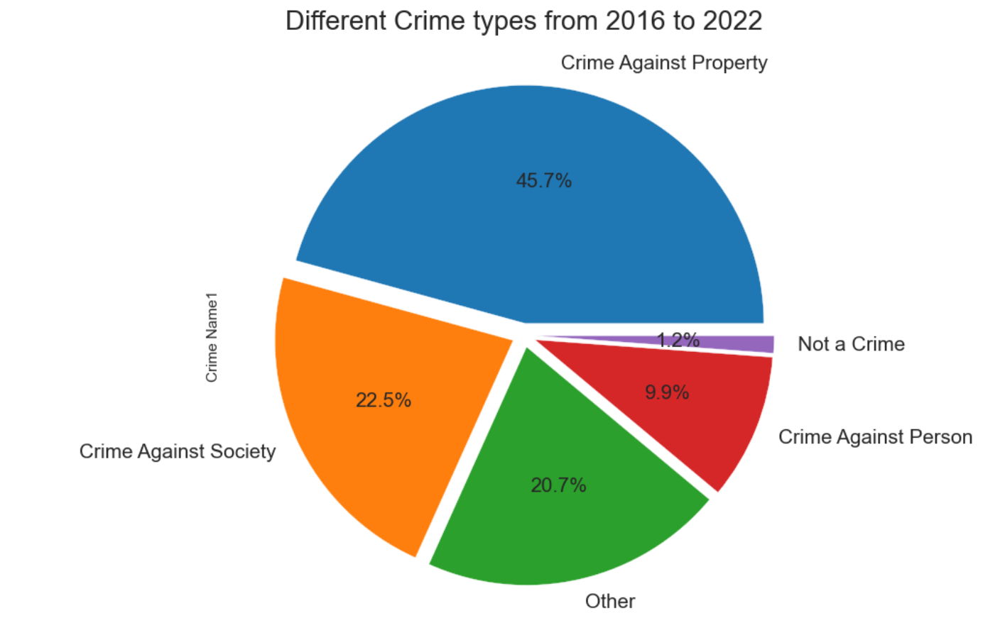
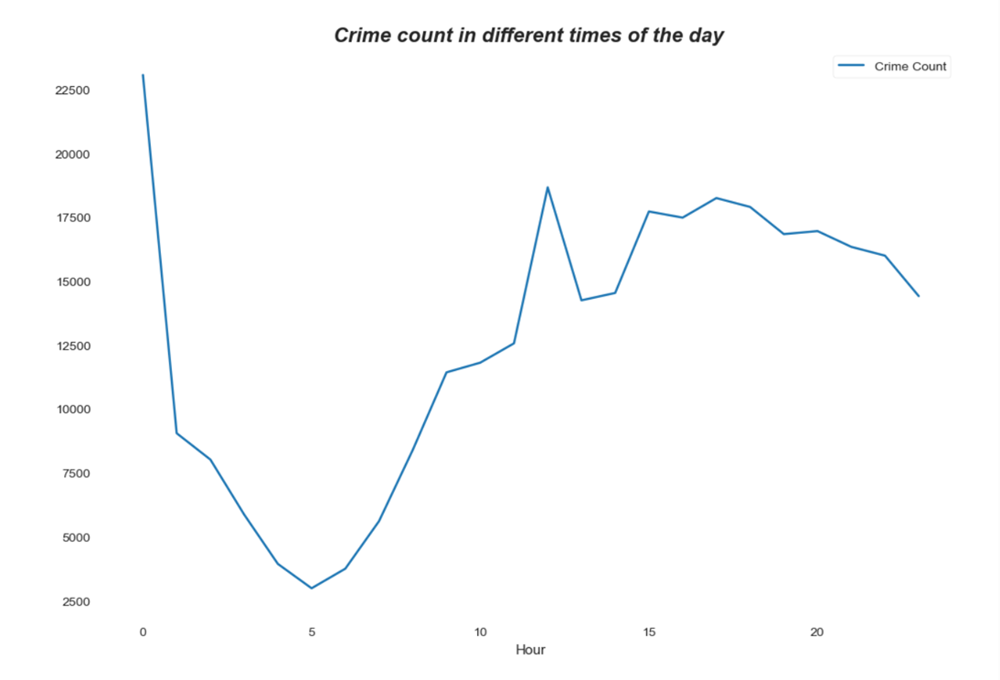

# EDA-Python

# Montgomery County Crime Data Analysis Using Python 📊

This project demonstrates an end-to-end Exploratory Data Analysis (EDA) of crime incidents reported in Montgomery County, Maryland. Using Python, the analysis focuses on identifying crime patterns, trends, high-risk locations, and peak occurrence periods to better understand public safety dynamics and support data-driven decision-making.

The project includes data cleaning, feature engineering, statistical analysis, and visualizations to uncover actionable insights from over 300,000 reported crime records.

---

## 🛠️ Tech Stack

* **Python**
* **Pandas & NumPy** – Data preparation and analysis
* **Matplotlib & Seaborn** – Data visualization
* **WordCloud** – Crime keyword analysis

---

## 📂 Dataset Overview

The dataset contains crime incident records reported by the Montgomery County Police Department under the National Incident-Based Reporting System (NIBRS).

### Dataset Highlights

* 306,000+ crime records
* 30 attributes
* Crime classification details
* Date and time of incidents
* Location information including city, district, ZIP code, latitude, and longitude

### Key Fields Analyzed

* Crime Category
* Crime Type
* Police District
* City
* Incident Date and Time
* Location Information

> **Dataset Source:** The raw dataset is not included in this repository. Download it from Kaggle before running the notebook:
>
> https://www.kaggle.com/datasets/ameeraabdi/montgomery-crime-dataset

---

## 📊 Dashboard Preview

---

## 🔍 Analysis Performed

* Data quality assessment and cleaning
* Missing value analysis
* Crime category distribution analysis
* Year-over-year crime trend analysis
* Hourly crime occurrence analysis
* Location-based crime analysis by city and district
* Visualization of crime patterns and hotspots

---

## 🚀 Key Insights

### Crime Trends

Crime incidents have generally declined over time, with the highest reported volumes observed in earlier years of the dataset.

### Crime Categories

Property-related crimes account for the largest share of reported incidents, with theft-related offenses appearing most frequently.

### Peak Crime Hours

Crime activity is concentrated during late evening and overnight hours, indicating higher incident volumes around midnight.

### Geographic Analysis

Silver Spring consistently reports the highest number of incidents among the cities analyzed, making it a key area for further investigation and resource planning.

---

## 📈 Business Value

This analysis demonstrates how data analytics can be used to:

* Identify high-risk locations and time periods
* Support resource allocation decisions
* Monitor crime trends over time
* Enable evidence-based public safety planning
* Communicate insights through effective visual storytelling

---

## 📁 Repository Contents

* `Crime data analysis.ipynb` – Complete analysis notebook
* `images/` – Visualization screenshots
* `README.md` – Project documentation

---
